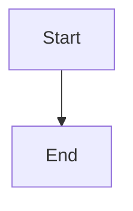
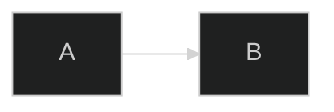
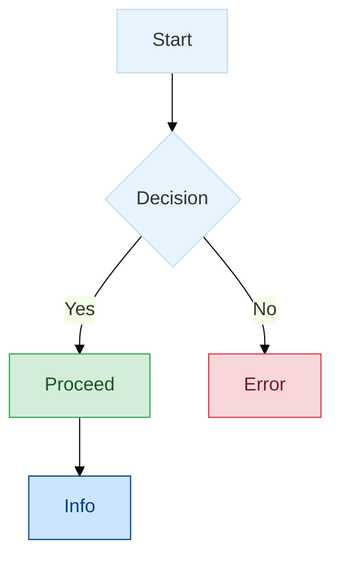

# Mermaid Diagram Syntax — Expert Skill

## When to Use This Skill

Activate when:
- User asks to create, edit, or fix a Mermaid diagram
- User wants to visualise something as a diagram in Obsidian
- User mentions Mermaid syntax, flowcharts, sequence diagrams, or any Mermaid diagram type
- User asks about diagram styling, theming, or configuration
- User wants to convert information into a visual diagram

## Obsidian Integration

### Embedding Diagrams

Wrap Mermaid code in a fenced code block with the `mermaid` language identifier:

````

````

### Key Points for Obsidian

- Obsidian bundles its own Mermaid version (may lag behind the latest release)
- `%%{init:}%%` directives work inside Obsidian code blocks
- Frontmatter config (`---` block) goes at the very top of the mermaid code block, before the diagram declaration
- Interactive features (`click`, `href`) are limited — links and callbacks may not function
- Diagrams render in both live preview and reading modes
- The **Mermaid Tools** community plugin (installed in this vault) provides a toolbar and live preview
- For hand-drawn style diagrams, consider **Excalidraw** (also installed) as an alternative
- Use `%%` for comments: `%% This is a comment`

### Frontmatter Config (preferred over directives)



### Init Directive (still works)


---

## Quick Reference — All Diagram Types

| Diagram | Declaration | Best For |
|---------|-------------|----------|
| [Flowchart](#flowchart) | `flowchart TD` | Processes, workflows, decision trees |
| [Sequence](#sequence-diagram) | `sequenceDiagram` | API calls, message flows, interactions |
| [Class](#class-diagram) | `classDiagram` | OOP design, data models, type hierarchies |
| [State](#state-diagram) | `stateDiagram-v2` | State machines, lifecycle diagrams |
| [ER](#entity-relationship-diagram) | `erDiagram` | Database schemas, data relationships |
| [Gantt](#gantt-chart) | `gantt` | Project timelines, schedules |
| [Pie](#pie-chart) | `pie` | Proportional data, distributions |
| [Mindmap](#mindmap) | `mindmap` | Brainstorming, topic hierarchies |
| [Timeline](#timeline) | `timeline` | Chronological events, history |
| [Quadrant](#quadrant-chart) | `quadrantChart` | 2D categorisation, priority matrices |
| [Sankey](#sankey-diagram) | `sankey-beta` | Flow quantities, resource allocation |
| [XY Chart](#xy-chart) | `xychart-beta` | Bar/line charts, numeric data |
| [Block](#block-diagram) | `block-beta` | System architecture, grid layouts |
| [Packet](#packet-diagram) | `packet-beta` | Network protocols, bit fields |
| [Architecture](#architecture-diagram) | `architecture-beta` | Cloud infra, system topology |
| [Kanban](#kanban-board) | `kanban` | Task boards, workflow status |
| [Git Graph](#git-graph) | `gitGraph` | Branch strategies, git history |
| [ZenUML](#zenuml) | `zenuml` | Sequence diagrams (alternative syntax) |
| [User Journey](#user-journey) | `journey` | UX flows, satisfaction mapping |
| [Requirement](#requirement-diagram) | `requirementDiagram` | Requirements traceability |
| [C4](#c4-diagram) | `C4Context` | Software architecture (C4 model) |
| [Radar](#radar-chart) | `radar-beta` | Multi-axis comparison |

---

## Flowchart

**Declaration:** `flowchart` followed by direction: `TB`/`TD` (top-down), `BT`, `LR`, `RL`

### Node Shapes

| Syntax | Shape |
|--------|-------|
| `A[text]` | Rectangle |
| `A(text)` | Rounded rectangle |
| `A([text])` | Stadium / pill |
| `A[[text]]` | Subroutine |
| `A[(text)]` | Cylinder (database) |
| `A((text))` | Circle |
| `A(((text)))` | Double circle |
| `A{text}` | Diamond (decision) |
| `A{{text}}` | Hexagon |
| `A[/text/]` | Parallelogram (lean right) |
| `A[\text\]` | Parallelogram (lean left) |
| `A[/text\]` | Trapezoid |
| `A[\text/]` | Inverted trapezoid |
| `A>text]` | Flag / asymmetric |

### Extended Shapes (v11.3.0+)

```
A@{ shape: cloud, label: "My Cloud" }
```

Key shapes: `rect`, `rounded`, `stadium`, `diam`, `hex`, `circle`, `sm-circ`, `dbl-circ`, `fr-circ`, `f-circ`, `cross-circ`, `cyl`, `h-cyl`, `lin-cyl`, `doc`, `lin-doc`, `docs`, `tag-doc`, `fr-rect`, `lin-rect`, `div-rect`, `st-rect`, `tag-rect`, `notch-rect`, `win-pane`, `tri`, `flip-tri`, `lean-r`, `lean-l`, `trap-t`, `trap-b`, `sl-rect`, `curv-trap`, `bow-rect`, `notch-pent`, `cloud`, `hourglass`, `bolt`, `brace`, `brace-r`, `braces`, `bang`, `fork`, `delay`, `flag`, `odd`, `text`

See `references/flowchart-shapes.md` for the full shape catalogue with descriptions.

### Icons and Images in Nodes (v11.3.0+)

```
A@{ icon: "fa:fa-gear", form: "circle", label: "Settings", pos: "t", h: 48 }
B@{ img: "https://example.com/logo.png", label: "Logo", pos: "t", w: 60, h: 60 }
```

### Arrows / Links

| Syntax | Description |
|--------|-------------|
| `-->` | Solid arrow |
| `---` | Solid line (no arrow) |
| `-.->` | Dotted arrow |
| `-.-` | Dotted line |
| `==>` | Thick arrow |
| `===` | Thick line |
| `--o` | Circle end |
| `--x` | Cross end |
| `<-->` | Bidirectional |
| `o--o` | Bidirectional circles |
| `x--x` | Bidirectional crosses |
| `~~~` | Invisible link (layout only) |

**Length:** Extra dashes/dots/equals make links longer: `----`, `-..-`, `====`

**Labels:**
```
A -->|label| B
A -- label text --> B
A -. label .-> B
A == label ==> B
```

### Subgraphs

```
subgraph id [Title]
    direction LR
    A --> B
end
```

Subgraphs can be nested and linked to each other.

### Chaining

```
A --> B --> C
A & B --> C & D
```

### Markdown in Nodes

```
A["`**Bold** and *italic*`"]
```

### Special Characters

Use entity codes: `#35;` for `#`, `#quot;` for `"`, `#semi;` for `;`

**Warning:** Avoid lowercase `end` as a node name — use `End` or `END`.

### Styling

```
%% Inline style
style nodeId fill:#f9f,stroke:#333,stroke-width:4px

%% Class definition
classDef highlight fill:#f96,stroke:#333,stroke-width:2px,color:#fff
class nodeA,nodeB highlight

%% Shorthand assignment
C:::highlight --> D

%% Default style
classDef default fill:#f9f,stroke:#333

%% Link styling by index
linkStyle 0 stroke:#ff3,stroke-width:4px,color:red
linkStyle 1,2 color:blue
```

### Curve Types

Set via config: `basis`, `bumpX`, `bumpY`, `cardinal`, `catmullRom`, `linear`, `monotoneX`, `monotoneY`, `natural`, `step`, `stepAfter`, `stepBefore`

---

## Sequence Diagram

**Declaration:** `sequenceDiagram`

### Participant Types

```
participant A as Alice
actor B as Bob
boundary C as Controller
control D as Dispatcher
entity E as Entity
database F as DB
collections G as Cache
queue H as Queue
```

### Arrows

| Syntax | Description |
|--------|-------------|
| `->>` | Solid with arrowhead |
| `-->>` | Dotted with arrowhead |
| `->` | Solid, no arrowhead |
| `-->` | Dotted, no arrowhead |
| `<<->>` | Solid bidirectional |
| `<<-->>` | Dotted bidirectional |
| `-x` | Solid with cross |
| `--x` | Dotted with cross |
| `-)` | Solid open arrow (async) |
| `--)` | Dotted open arrow (async) |

### Activations

```
activate A
deactivate A
A->>+B: Request (activates B)
B->>-A: Response (deactivates B)
```

### Notes

```
Note right of A: Right-side note
Note left of A: Left-side note
Note over A: Over A
Note over A,B: Spanning note
```

### Grouping Boxes

```
box Aqua "Service Layer"
    participant A
    participant B
end
box rgb(33,66,99) "Database Layer"
    participant C
end
```

### Control Flow

```
loop Every 5 seconds
    A->>B: Heartbeat
end

alt Success
    A->>B: 200 OK
else Failure
    A->>B: 500 Error
end

opt Optional path
    A->>B: Maybe
end

par Action 1
    A->>B: Do X
and Action 2
    A->>C: Do Y
end

critical Important
    A->>B: Must succeed
option Fallback
    A->>C: Alternative
end

break On error
    A->>B: Abort
end
```

### Highlighting

```
rect rgba(0, 128, 255, 0.1)
    A->>B: Highlighted region
end
```

### Participant Lifecycle

```
create participant B
A->>B: Create
destroy B
```

---

## Class Diagram

**Declaration:** `classDiagram`

### Class Syntax

```
class Animal {
    +String name
    -int age
    #List~String~ tags
    ~internalMethod() void
    +eat(food) bool
    abstractMethod()*
    staticMethod()$
}
```

**Visibility:** `+` public, `-` private, `#` protected, `~` package/internal
**Modifiers:** `*` abstract, `$` static (suffix on methods)
**Generics:** Use tildes: `List~int~`, `Map~String, Object~`

### Relationships

| Syntax | Type |
|--------|------|
| `<\|--` | Inheritance |
| `*--` | Composition |
| `o--` | Aggregation |
| `-->` | Association |
| `--` | Solid link |
| `..>` | Dependency |
| `..\|>` | Realisation |
| `..` | Dashed link |

### Cardinality

```
Customer "1" --> "*" Order : places
Customer "1..*" --> "0..1" Address : lives at
```

### Annotations

```
class Shape {
    <<Interface>>
}
class Colour {
    <<Enumeration>>
    RED
    GREEN
    BLUE
}
```

Types: `<<Interface>>`, `<<Abstract>>`, `<<Service>>`, `<<Enumeration>>`

### Namespaces

```
namespace Domain {
    class User
    class Order
}
```

### Notes

```
note "General note"
note for ClassName "Specific note"
```

### Direction

```
classDiagram
    direction LR
```

---

## State Diagram

**Declaration:** `stateDiagram-v2`

### States and Transitions

```
s1 : Idle
state "Processing request" as s2
s1 --> s2 : on_request
s2 --> s1 : on_complete
```

### Start / End

```
[*] --> s1
s1 --> [*]
```

### Composite States

```
state Active {
    [*] --> Running
    Running --> Paused : pause
    Paused --> Running : resume
    Running --> [*]
}
```

### Choice, Fork, Join

```
state decision <<choice>>
s1 --> decision
decision --> s2 : if valid
decision --> s3 : if invalid

state fork_state <<fork>>
state join_state <<join>>
[*] --> fork_state
fork_state --> A
fork_state --> B
A --> join_state
B --> join_state
join_state --> [*]
```

### Concurrency

```
state Parallel {
    [*] --> Thread1
    --
    [*] --> Thread2
}
```

### Notes

```
note right of s1
    Multi-line note
end note
note left of s2 : Short note
```

---

## Entity Relationship Diagram

**Declaration:** `erDiagram`

### Entities

```
CUSTOMER {
    string name PK
    int age
    string email UK
    int address_id FK "delivery address"
}
```

Format: `type name [PK|FK|UK] ["comment"]`

### Relationships

```
CUSTOMER ||--o{ ORDER : "places"
ORDER ||--|{ LINE_ITEM : "contains"
CUSTOMER }|..|{ ADDRESS : "uses"
```

### Cardinality

| Symbol | Meaning |
|--------|---------|
| `\|\|` | Exactly one |
| `\|o` / `o\|` | Zero or one |
| `\|{` / `}\|` | One or more |
| `o{` / `}o` | Zero or more |

### Line Types

- `--` solid (identifying relationship)
- `..` dashed (non-identifying relationship)

---

## Gantt Chart

**Declaration:** `gantt`

```
gantt
    title Project Plan
    dateFormat YYYY-MM-DD
    axisFormat %Y-%m-%d
    excludes weekends

    section Design
    Mockups        :a1, 2024-01-01, 14d
    Review         :after a1, 7d

    section Development
    API            :crit, active, 2024-01-22, 30d
    Frontend       :2024-02-01, 25d
    Launch         :milestone, 2024-03-01, 0d
    Done task      :done, 2024-01-01, 2024-01-10
```

### Task Tags (combinable)

`done`, `active`, `crit`, `milestone`

### Timing

```
taskName :tags, id, startDate, duration
taskName :tags, id, after otherId, duration
taskName :tags, id, startDate, until otherId
```

**Duration units:** `d` (days), `w` (weeks), `h` (hours), `m` (minutes), `s` (seconds), `M` (months), `y` (years)

### Features

```
excludes weekends
excludes 2024-12-25, sunday
tickInterval 1week
displayMode compact
todayMarker stroke-width:5px,stroke:#0f0
todayMarker off
```

---

## Pie Chart

**Declaration:** `pie`

```
pie showData title Budget Allocation
    "Engineering" : 45
    "Marketing" : 25
    "Operations" : 20
    "Other" : 10
```

- `showData` — displays values after legend text
- Values must be positive numbers

---

## Mindmap

**Declaration:** `mindmap`

Indentation-based hierarchy:

```
mindmap
    root((Central Idea))
        Topic A
            Subtopic 1
            Subtopic 2
        Topic B
            ))Explosion((
            )Cloud(
            {{Hexagon}}
```

### Node Shapes

| Syntax | Shape |
|--------|-------|
| `text` | Default rectangle |
| `[text]` | Square |
| `(text)` | Rounded |
| `((text))` | Circle |
| `))text((` | Bang / explosion |
| `)text(` | Cloud |
| `{{text}}` | Hexagon |

### Icons and Classes

```
Node::icon(fa fa-star)
Node:::className
```

---

## Timeline

**Declaration:** `timeline`

```
timeline
    title Company History
    section Early Days
        2015 : Founded
             : First product
        2016 : Series A
    section Growth
        2018 : 100 employees : IPO
        2020 : Global expansion
```

**Direction (v11.14.0+):** `timeline LR` or `timeline TD`

---

## Quadrant Chart

**Declaration:** `quadrantChart`

```
quadrantChart
    title Priority Matrix
    x-axis Low Effort --> High Effort
    y-axis Low Impact --> High Impact
    quadrant-1 Do First
    quadrant-2 Schedule
    quadrant-3 Delegate
    quadrant-4 Eliminate
    Task A: [0.8, 0.9]
    Task B: [0.2, 0.7]
    Task C: [0.6, 0.3]
```

Quadrants: `quadrant-1` = top right, `quadrant-2` = top left, `quadrant-3` = bottom left, `quadrant-4` = bottom right. Coordinates range 0–1.

---

## Sankey Diagram

**Declaration:** `sankey-beta`

CSV format — exactly 3 columns: source, target, value:

```
sankey-beta

Electricity,Residential,30
Electricity,Commercial,20
Gas,Residential,15
Gas,Industrial,25
```

Quote values containing commas: `"Source, Inc",Target,100`

---

## XY Chart

**Declaration:** `xychart-beta`

```
xychart-beta
    title "Monthly Sales"
    x-axis [Jan, Feb, Mar, Apr, May]
    y-axis "Revenue" 4000 --> 11000
    bar [5000, 6000, 7500, 8200, 9800]
    line [5000, 6000, 7500, 8200, 9800]
```

**Horizontal:** `xychart-beta horizontal`
**Categorical x-axis:** `x-axis [cat1, "cat 2", cat3]`
**Numeric x-axis:** `x-axis "Title" min --> max`

---

## Block Diagram

**Declaration:** `block-beta`

```
block-beta
    columns 3
    A["Block A"] B["Block B"] C["Block C"]
    D["Wide Block"]:3
    space
    E["Block E"]

    block:group1
        F["Nested"]
        G["Blocks"]
    end

    A --> D
    D --> E
```

- `columns N` — grid columns
- `space` / `space:N` — empty cells
- `Block:N` — span N columns
- Nested: `block:id ... end`
- Uses flowchart node shapes and arrow syntax

---

## Packet Diagram

**Declaration:** `packet-beta`

```
packet-beta
    0-15: "Source Port"
    16-31: "Destination Port"
    32-63: "Sequence Number"
    64-95: "Acknowledgement Number"
```

- Bit ranges: `start-end: "Label"`
- Auto-continue (v11.7.0+): `+8: "8-bit field"`
- Config: `bitsPerRow` (default 32)

---

## Architecture Diagram

**Declaration:** `architecture-beta`

```
architecture-beta
    group cloud(cloud)[Cloud]

    service api(server)[API] in cloud
    service db(database)[DB] in cloud
    service web(internet)[Web App]

    junction junc in cloud

    web:R --> L:api
    api:B --> T:junc
    junc:R --> L:db
```

### Components

- **Groups:** `group id(icon)[Label]` / `group id(icon)[Label] in parent`
- **Services:** `service id(icon)[Label]` / `service id(icon)[Label] in group`
- **Junctions:** `junction id` / `junction id in group`

### Edge Syntax

```
serviceA:Direction arrowType Direction:serviceB
```

**Directions:** `T` (top), `B` (bottom), `L` (left), `R` (right)
**Arrows:** `--` (plain), `-->` (right arrow), `<--` (left arrow), `<-->` (bidirectional)

### Built-in Icons

`cloud`, `database`, `disk`, `internet`, `server`

Extended via iconify (200k+ icons): `service s(aws:s3-bucket)[S3]`

---

## Kanban Board

**Declaration:** `kanban`

```
kanban
    todo[To Do]
        task1[Design mockups]@{ assigned: "Alice", priority: "High" }
        task2[Write specs]
    inprogress[In Progress]
        task3[Build API]@{ assigned: "Bob", ticket: "DEV-202" }
    done[Done]
        task4[Setup CI]
```

**Metadata:** `@{ assigned: "name", ticket: "ID", priority: "High" }`
**Priority values:** `Very High`, `High`, `Low`, `Very Low`

**Ticket links config:**
```
---
config:
  kanban:
    ticketBaseUrl: 'https://project.atlassian.net/browse/#TICKET#'
---
```

---

## Git Graph

**Declaration:** `gitGraph`

```
gitGraph
    commit
    commit id: "feat" tag: "v1.0"
    branch develop
    checkout develop
    commit type: HIGHLIGHT
    checkout main
    merge develop id: "merge" tag: "v2.0"
```

**Orientation:** `gitGraph LR` (default), `gitGraph TB`, `gitGraph BT`

### Commands

- `commit` — optional: `id:`, `tag:`, `type:` (NORMAL, REVERSE, HIGHLIGHT)
- `branch name` — optional: `order: N`
- `checkout name` (or `switch name`)
- `merge name` — optional: `id:`, `tag:`, `type:`
- `cherry-pick id: "commitId"`

---

## ZenUML

**Declaration:** `zenuml`

Alternative sequence diagram syntax using curly braces for nesting:

```
zenuml
    Alice->Bob.request() {
        Bob->Carol.validate() {
            @return valid
        }
        @return response
    }
```

### Messages

- Sync: `A->B.method()` or `A->B: message`
- Async: `A=>B: message`
- Creation: `A->new B: create`
- Reply: `@return: value`

### Control Flow

```
if (cond) { ... } else { ... }
while (cond) { ... }
for (items) { ... }
try { ... } catch { ... } finally { ... }
par { action1; action2 }
opt { ... }
```

---

## User Journey

**Declaration:** `journey`

```
journey
    title Onboarding Experience
    section Sign Up
        Visit landing page: 5: User
        Fill form: 3: User
        Verify email: 4: User, System
    section First Use
        Complete tutorial: 2: User
        Create first project: 4: User
```

- **Score:** 1 (worst) to 5 (best)
- **Actors:** comma-separated after score

---

## Requirement Diagram

**Declaration:** `requirementDiagram`

```
requirementDiagram
    requirement auth {
        id: REQ-001
        text: "System shall authenticate users"
        risk: High
        verifymethod: Test
    }

    element auth_module {
        type: module
        docref: auth.md
    }

    auth_module - satisfies -> auth
```

**Types:** `requirement`, `functionalRequirement`, `interfaceRequirement`, `performanceRequirement`, `physicalRequirement`, `designConstraint`

**Risk:** `Low`, `Medium`, `High`
**Verify:** `Analysis`, `Inspection`, `Test`, `Demonstration`
**Relations:** `contains`, `copies`, `derives`, `satisfies`, `verifies`, `refines`, `traces`

---

## C4 Diagram

**Declarations:** `C4Context`, `C4Container`, `C4Component`, `C4Dynamic`, `C4Deployment`

```
C4Context
    title System Context
    Person(user, "User", "A user of the system")
    System(sys, "System", "The main system")
    System_Ext(ext, "External", "Third-party service")

    Rel(user, sys, "Uses")
    Rel(sys, ext, "Calls API")
```

### Shape Functions

`Person`, `Person_Ext`, `System`, `System_Ext`, `SystemDb`, `SystemQueue`, `Container`, `ContainerDb`, `ContainerQueue`, `Component`, `ComponentDb`, `ComponentQueue`, `Deployment_Node`, `Node`

### Boundaries

```
Boundary(b, "Label", "type") { ... }
Enterprise_Boundary(b, "Label") { ... }
System_Boundary(b, "Label") { ... }
Container_Boundary(b, "Label") { ... }
```

### Relationships

`Rel(from, to, "Label")`, `BiRel(from, to, "Label")`, `Rel_U`, `Rel_D`, `Rel_L`, `Rel_R`, `Rel_Back`

---

## Radar Chart

**Declaration:** `radar-beta`

```
radar-beta
    title Skill Assessment
    axis Design, Code, Test, Deploy, Docs
    curve Team_A{4, 3, 5, 2, 4}
    curve Team_B{2, 5, 3, 4, 3}
```

Or with explicit axis mapping: `curve Team{Design: 3, Code: 4, Test: 2}`

**Config:** `showLegend`, `max`, `min`, `ticks`, `graticule` (`"circle"` or `"polygon"`)

---

## Global Theming & Styling

### Built-in Themes

`default`, `neutral`, `dark`, `forest`, `base`

Only `base` supports customisation via `themeVariables`.

### Theme Variables (base theme)

```
---
config:
  theme: base
  themeVariables:
    primaryColor: "#ff6600"
    primaryTextColor: "#fff"
    primaryBorderColor: "#cc5200"
    lineColor: "#333"
    secondaryColor: "#ddd"
    tertiaryColor: "#eee"
    background: "#f4f4f4"
    fontFamily: "trebuchet ms, verdana, arial"
    fontSize: "16px"
    noteBkgColor: "#fff5ad"
    noteTextColor: "#333"
---
```

**Important:** Only hex colour codes (`#rrggbb`) work — named colours like `red` are not supported.

### Diagram-Specific Theme Variables

See `references/theme-variables.md` for the complete list of variables per diagram type.

### Common Styling Pattern (Flowchart)



---

## Tips for Obsidian Usage

1. **Start simple** — get the structure right first, then add styling
2. **Use `direction LR`** for wide diagrams that fit better in notes
3. **Prefer `TD` / `TB`** for tall process flows
4. **Quote labels with spaces** — `A["My Label"]` not `A[My Label]` (for safety with special chars)
5. **Escape special characters** — use entity codes: `#35;` for `#`, `#quot;` for `"`
6. **Debug rendering issues** — strip styling first to isolate syntax errors
7. **For large diagrams** — break into multiple smaller diagrams with cross-references via `[[wikilinks]]` in surrounding text
8. **Combine with Dataview** — reference diagram notes in Dataview queries for dynamic documentation
